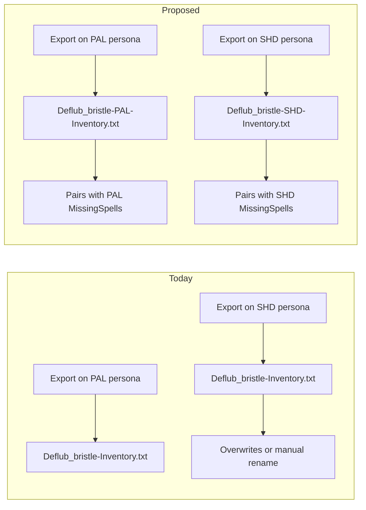

# Change Request: Class-Aware Inventory Output Filenames

## The Ask

Update EverQuest's `/outputfile inventory` command so exported files are named like MissingSpells exports:

| Command | Current filename | Proposed filename |
|---------|------------------|-------------------|
| `/outputfile missingspells` | `Deflub_bristle-PAL-MissingSpells.txt` | *(no change — already correct)* |
| `/outputfile inventory` | `Deflub_bristle-Inventory.txt` | `Deflub_bristle-PAL-Inventory.txt` |

Use the **active persona's class abbreviation** at export time (same abbreviation scheme already used for MissingSpells).

Reference: [Alternate Personas Guide](https://www.everquest.com/guides/eq-alternate-personas)

---

## Copy-Paste Change Request (for forums, bug reports, or dev feedback)

### Summary

Please add the active persona's class to inventory output filenames, matching the existing MissingSpells naming pattern (`CharacterName_server-CLASS-MissingSpells.txt` → `CharacterName_server-CLASS-Inventory.txt`).

### Problem

Alternate Personas let one character play multiple fully functional classes while sharing name, bank, bags, and inventory. The game **remembers equipped gear per persona**, but `/outputfile inventory` only reflects **what is currently worn on the active persona**.

Today, every persona on the same character produces the **same filename**:

```
Deflub_bristle-Inventory.txt
```

If a player exports inventory on their Paladin persona, switches to Shadow Knight, and exports again, the second file **overwrites the first** (or the player must manually rename/move files). There is **no reliable way to tell which persona's loadout a dump represents** from the filename alone.

MissingSpells does not have this problem — it already includes class:

```
Deflub_bristle-PAL-MissingSpells.txt
Deflub_bristle-SHD-MissingSpells.txt
```

This asymmetry is confusing and creates real friction for anyone trying to track gear across personas.

### Why this matters for players

**1. Multi-role characters are common with Personas**

Players routinely maintain tank, healer, caster, or support personas on a single character. Officers, boxers, and solo players all benefit from being able to snapshot **each persona's worn gear** without manual file management.

**2. Gear is persona-specific even though inventory is shared**

Per the [Personas FAQ](https://www.everquest.com/guides/eq-alternate-personas): *"We'll remember which items were worn for each persona"* — but an inventory dump only shows the active persona's equipment. Without class in the filename, players cannot build a complete picture of what each persona is wearing unless they invent their own naming scheme every time they export.

**3. Prevents accidental data loss**

A player who exports on Warrior, forgets to rename, switches to Cleric, and exports again **silently loses** the Warrior gear snapshot. Class in the filename makes each export a distinct, identifiable file by default.

**4. Consistency with existing output conventions**

The client already persona-scopes other outputs and UI:
- MissingSpells: `CharacterName_server-CLASS-MissingSpells.txt`
- UI files: `UI_Charactername_Class_Server` (per official Personas FAQ)

Inventory is the odd one out. Aligning it reduces cognitive load and documentation burden for players and community tools.

**5. Raid and guild gear review**

Raid leaders and guild gear officers often collect `/outputfile` dumps to review team readiness, tier levels, and slot gaps. With Personas, one character name can represent two or more roles. Class-labeled inventory files let officers collect **one folder of dumps** and immediately see which loadout belongs to which role — without asking each player which persona was active when they exported.

**6. Low implementation risk, high clarity payoff**

The game already knows the active persona's class at export time (it uses that class to determine equipped slots, usable items, and spell book). Adding that class to the filename mirrors an established pattern and does not require changing dump contents.

### Proposed behavior

When `/outputfile inventory` runs:
- Filename includes active persona class: `{Character}_{Server}-{CLASS}-Inventory.txt`
- Example: Paladin persona → `Deflub_bristle-PAL-Inventory.txt`; Shadow Knight persona → `Deflub_bristle-SHD-Inventory.txt`
- Non-persona characters (base character only) would use their class abbreviation the same way MissingSpells does

### Current player workarounds (all worse than a native fix)

- Manually rename each export before switching persona
- Create subfolders per persona (`PAL/`, `SHD/`) and move files by hand
- Export only once and accept that other personas' worn gear is invisible in the dump
- Pair inventory with MissingSpells files and hope tooling can infer persona — but **equipped gear in a shared-inventory dump still reflects only whichever persona was active at export time**, so spell files alone cannot reconstruct inactive personas' loadouts

### Ecosystem benefit

Community gear-tracking tools (including the open-source [Inventory Parser](https://github.com/Neclub/Inventory-Parser) project) already pair inventory and MissingSpells files by character and class. Native class-aware inventory filenames would let players drop all dumps in one folder and reliably match **each persona's worn gear** to **that persona's spell log** — the same workflow MissingSpells already supports.

---

## Supporting technical context (from Inventory Parser)

The parser documents this limitation explicitly in [HowToUse.md](HowToUse.md):

> The filename never includes class. The dump reflects **equipped items for the active persona only**.

MissingSpells class comes **only** from the filename:

```14:17:src/inventory_parser/missing_spells.py
_FILENAME_RE = re.compile(
    r"^(.+)_([^-]+)-([A-Za-z]+)-MissingSpells\.txt$",
    re.IGNORECASE,
)
```

Inventory has no class segment:

```11:14:src/inventory_parser/parser.py
_INVENTORY_FILENAME_RE = re.compile(
    r"^(.+)_([^-]+)-Inventory\.txt$",
    re.IGNORECASE,
)
```

When multiple personas share one inventory dump in the same folder, tooling must **skip or warn on gear columns** because the dump cannot represent inactive personas' equipment — the root cause is the missing class identity in the inventory export, not tooling limitations.



---

## Optional shorter version (Discord / forum reply)

> With Alternate Personas, inventory is shared but **equipped gear is per persona**. `/outputfile inventory` only shows what's worn on the **active** persona, yet the filename is always `Name_server-Inventory.txt` — so exporting multiple personas overwrites the file or forces manual renaming. MissingSpells already uses `Name_server-CLASS-MissingSpells.txt`. Please add the same `-CLASS-` segment to inventory output so players (and raid officers) can keep distinct, identifiable gear snapshots for each persona without workarounds.

---

## What you are NOT asking for (scope boundary)

- No change to dump **contents** — only filename
- No request to dump all personas' worn gear in one file (that would be a separate, larger feature)
- No request to change shared inventory / bank behavior

This keeps the ask narrow, consistent with existing conventions, and easy for devs to evaluate.
