# December Expansion Update Plan

Target: **December 2026** EQ expansion (name TBD). Scrape-only checklist: [`Scrapes-Needed.md`](Scrapes-Needed.md). This repo does not scrape at runtime — it uses **bundled JSON** built from EQ Resource pages plus **regex/name rules** for gear, runes, and craft mats. Every new expansion touches the same pipeline Shattering of Ro (SoR) uses today.

**Announcement status (2026-07-27):** Name not announced. [July 2026 Producer’s Letter](https://www.everquest.com/news/eq-producers-letter-july-2026) teases demiplanes / fate / “Mad”. Fill remaining Phase 1 blanks when the official name and EQ Resource pages go live.

```mermaid
flowchart LR
  subgraph gather [Phase1_GatherLinks]
    A[EQResource pages live]
    B[Fill link checklist]
  end
  subgraph scrape [Phase2_ScrapeAndCommit]
    C[build_vendor_json.py]
    D[scrape_spell_expansions.py]
    E[Commit JSON under data/]
  end
  subgraph config [Phase3_CodeConfig]
    F[gear_tiers.py]
    G[unmade_gear.py]
    H[spell/rune configs]
    I[achievement_parser.py]
    J[excel_theme.py colors]
  end
  subgraph verify [Phase4_Validate]
    K[pytest]
    L[Sample inventory exports]
  end
  gather --> scrape --> config --> verify
```



---

## Timeline (December 2026)

| When | Action |
|------|--------|
| **Expansion announcement** | Start Phase 1 checklist; bookmark EQ Resource expansion subdomain |
| **Beta / PTR** | Collect sample item names from inventory dumps; draft regex patterns |
| **Launch day (or when EQ Resource pages go live)** | Run scrapers; fill in all TBD values |
| **Launch + 1–3 days** | Patch skip rules, tier regex, unmade mat rules from real bag items |
| **Before your guild's next audit** | Full pytest + HTML/Excel export smoke test |

---

## Phase 1 — Link & naming checklist (with prompts)

Use these prompts in Cursor (or with EQ Resource open) once the expansion is announced. Replace placeholders: `[EXPANSION_NAME]`, `[ABBREV]` (3–4 letter code, e.g. `sor`), `[YEAR]` (2026), `[SUBDOMAIN]` (EQ Resource subdomain, e.g. `sor`).

### 1.1 Expansion identity (needed everywhere)

**Prompt:**
> The new EverQuest expansion is `[EXPANSION_NAME]` (release `[YEAR]`). What short abbreviation should we use in tier codes (e.g. `SOR-R1`)? List: full name, abbreviation, release year, and EQ Resource subdomain if one exists.

**Record here:**
- Full name: `TBD` (teaser only: demiplanes / fate / “Mad”)
- Abbreviation (tier prefix): `TBD`
- Release year: `2026`
- Short key for JSON (`sor`, `tob`, etc.): `TBD`
- EQ Resource subdomain: `TBD`

---

### 1.2 Raid vendor gear page (R1 vendor JSON)

**Where it goes:** [`scripts/build_vendor_json.py`](../scripts/build_vendor_json.py) `PAGES` dict → new file `{abbrev}_r1_vendor_items.json`

**Prompt:**
> Find the EQ Resource raid vendor page for `[EXPANSION_NAME]`. Previous examples:
> - SoR: `https://sor.eqresource.com/raidvendorgood.php`
> - ToB: `https://tob.eqresource.com/raidvendor.php`
> - LS: `https://ls.eqresource.com/raidvendor.php`
>
> What is the exact URL for `[EXPANSION_NAME]` R1 raid vendor gear? Confirm the page lists finished armor/weapons (not tradeskill mats).

**Record:**
- R1 vendor URL: `TBD` (not live until expansion pages exist on EQ Resource)
- Tier code for R1 raid gear: `TBD-R1`
- Skip rules: `TBD`

**Follow-up prompt (skip rules):**
> On the `[EXPANSION_NAME]` raid vendor page, list item names we should **exclude** from vendor JSON because they are tradeskill mats, spell runes, or containers — similar to how SoR skips `Fractured … Fastener` and ToB skips `… of Rebellion`. Give exact name prefixes/suffixes.

---

### 1.3 Anniversary / special raid event (if applicable)

**Where it goes:** same `PAGES` dict (see existing `ani27_raid_items.json` entry)

**Prompt:**
> Does `[EXPANSION_NAME]` or the December patch include an anniversary raid event with a distinct gear set on items.eqresource.com? If yes, provide the `itemsearch.php?raidevent=...` URL and the in-game keyword in item names (e.g. `Enduring Harmony` for ANI27).

**Record (or N/A):**
- Raid event search URL: `TBD` (mark N/A if December patch has no separate raid-event set; ANI27 remains current anniversary scrape)
- Name keyword / tier code: `TBD`

---

### 1.4 Spell expansion catalog (levels 121–130, possibly 131–135)

**Where it goes:**
- [`Examples/SpellData/Class120_130.txt`](../Examples/SpellData/Class120_130.txt) — class URLs (usually unchanged unless level range changes)
- [`src/inventory_parser/spell_scrape.py`](../src/inventory_parser/spell_scrape.py) — `EXPANSION_BY_IMAGE`
- [`scripts/scrape_spell_expansions.py`](../scripts/scrape_spell_expansions.py) → [`spell_expansions_121_130.json`](../src/inventory_parser/data/spell_expansions_121_130.json)

**Prompt (expansion image):**
> On spells.eqresource.com, open a level 126+ Rk. III spell from `[EXPANSION_NAME]`. What is the `` filename for the expansion column? Previous mappings: `sor.jpg` → Shattering of Ro, `tob.jpg` → The Outer Brood, `ls.jpg` → Laurion's Song.

**Record:**
- Image filename: `TBD.jpg`
- Canonical expansion name string: `TBD`

**Prompt (level range):**
> Does `[EXPANSION_NAME]` add spells above level 130? If yes, what is the new max level (e.g. 135)? Which level block owns the new expansion's spells (126–130 today is SoR-only)?

**Record:**
- New `LEVEL_MAX`: `130` (default until confirmed; bump if 131+)
- Spell level block for new expansion: `TBD–TBD`

**Prompt (class URLs — only if level min changes):**
> If the catalog must include levels above 130, update [`Class120_130.txt`](../Examples/SpellData/Class120_130.txt) URLs: change `level=121&range=greater` to start at the new minimum, or add a second URL file. List all 16 class URLs with the correct query params.

Existing template (one per class):
```
https://spells.eqresource.com/spellsearch.php?name=&class=wiz&level=121&range=greater&expac=&source=live&searchname=true
```

---

### 1.5 Spell rune turn-in items (Missing Runes + Rune Inventory)

**Where it goes:**
- [`src/inventory_parser/data/spell_rune_inventory.json`](../src/inventory_parser/data/spell_rune_inventory.json) — new `families` entry
- [`src/inventory_parser/spell_runes.py`](../src/inventory_parser/spell_runes.py) — `MISSING_RUNE_EXPANSION_GROUPS`
- [`src/inventory_parser/data/spell_rune_bands.json`](../src/inventory_parser/data/spell_rune_bands.json) — new level block

**Prompt:**
> For `[EXPANSION_NAME]`, what are the five spell rune turn-in item names (Minor through Glowing)? Format like:
> - SoR: `{Tier} Mirrorshard of Relic`
> - ToB: `Energized {Tier} Engram`
> - LS: `{Tier} Emblem of the Forge`
>
> Also list any **inert** or vendor-junk variants we must NOT count (e.g. `Inert Minor Engram`).

**Record:**
- Turn-in pattern: `_______________` (use `{Tier}` placeholder)
- Prefix (if any): `_______________`
- Suffix: `_______________`
- Items to exclude: `_______________`

**Prompt (level band):**
> Which spell levels use `[EXPANSION_NAME]` runes? Add a block to spell_rune_bands.json (pattern: 5-level bands, 121–125 = LS+ToB, 126–130 = SoR). Proposed block: levels `____–____`, `count_runes: true`.

---

### 1.6 Equipped gear tier keywords (regex classification)

**Where it goes:** [`src/inventory_parser/gear_tiers.py`](../src/inventory_parser/gear_tiers.py) — new `GearTier` rows at **top** of `_GEAR_TIERS` (newest first)

**Prompt:**
> For `[EXPANSION_NAME]`, list the in-game **subtitle keywords** for each gear tier (raid T1/T2, group G1/G2/G3). Examples:
> - SoR R2: `Resonant Fracture`
> - SoR R1: `Shattered Dominion`
> - ToB R1: `… of the Bound`
>
> Provide exact phrases as they appear in item names, and note ambiguous words (e.g. `Fracture` vs `Fractured`).

**Record:**

| Tier code | Keyword(s) in item name |
|-----------|-------------------------|
| `[ABBREV]-R2` (new current raid) | |
| `[ABBREV]-R1` | |
| `[ABBREV]-G3` | |
| `[ABBREV]-G2` | |
| `[ABBREV]-G1` | |

**Prompt (tradeskill exclusions):**
> List tradeskill mat naming patterns for `[EXPANSION_NAME]` that must NOT match gear tiers (prefixes like `Fractured`, `Valiant`, suffixes like `Fastener`, `Clasp`). These go in `_is_tradeskill_item()` and vendor `should_skip()`.

---

### 1.7 Unmade craft mats in bags (General inventory)

**Where it goes:** [`src/inventory_parser/unmade_gear.py`](../src/inventory_parser/unmade_gear.py)

**Prompt:**
> For `[EXPANSION_NAME]`, what T1 armor **container** names appear in bags (like SoR `Diminished Shattered …` or ToB `Obscured … Armor of the Bound`)? What T2 **tradeskill mat** names indicate unmade raid gear (like `Fractured Mask Fastener` or `Necklace Clasp of Rebellion`)? Give 2–3 real examples per tier with slot inference.

---

### 1.8 Achievements expansion header

**Where it goes:** [`src/inventory_parser/achievement_parser.py`](../src/inventory_parser/achievement_parser.py) — `EXPANSIONS_NEWEST_FIRST`

**Prompt:**
> Confirm the exact string EverQuest uses in `-Achievements.txt` section headers for `[EXPANSION_NAME]` (must match parser). Add as newest entry: `("[EXPANSION_NAME]", [YEAR])`.

---

## Phase 2 — Run scrapers and commit data

After URLs and `EXPANSION_BY_IMAGE` are filled in:

1. **Add vendor page** to [`scripts/build_vendor_json.py`](../scripts/build_vendor_json.py):
   ```python
   "{abbrev}_r1_vendor_items.json": ("https://{subdomain}.eqresource.com/...", "{ABBREV}-R1", "{abbrev}"),
   ```
2. **Add skip rules** in `should_skip()` for the new expansion key.
3. **Run vendor scraper:**
   ```powershell
   py -3 scripts/build_vendor_json.py
   ```
4. **Add image mapping** in [`spell_scrape.py`](../src/inventory_parser/spell_scrape.py); bump `LEVEL_MAX` if needed.
5. **Refresh spell catalog** (uses cache after first fetch):
   ```powershell
   py -3 scripts/scrape_spell_expansions.py --cache
   ```
6. **Refresh useful-spell list** if Raccoo’s xlsx under `Examples/SpellData/` was updated for the new expansion:
   ```powershell
   py -3 scripts/convert_useful_spells.py
   ```
7. **Commit** new/updated files under [`src/inventory_parser/data/`](../src/inventory_parser/data/).

---

## Phase 3 — Code config updates

| File | Change |
|------|--------|
| [`gear_tiers.py`](../src/inventory_parser/gear_tiers.py) | Add tier regex rows; add vendor JSON to `VENDOR_JSON_FILES`; update `SOR_CURRENT_TIER_CODE` → new current raid code (consider renaming constant later) |
| [`excel_theme.py`](../src/inventory_parser/excel_theme.py) | Shift color buckets: green = new `[ABBREV]-R2`, yellow = old current + ANI, etc.; update legend strings |
| [`unmade_gear.py`](../src/inventory_parser/unmade_gear.py) | T1 container + T2 tradeskill mat rules |
| [`spell_rune_inventory.json`](../src/inventory_parser/data/spell_rune_inventory.json) | New rune family |
| [`spell_runes.py`](../src/inventory_parser/spell_runes.py) | New `MissingRuneExpansionGroup` at top of tuple |
| [`spell_rune_bands.json`](../src/inventory_parser/data/spell_rune_bands.json) | New 131–135 block (or extend 126–130 if SoR shares band) |
| [`achievement_parser.py`](../src/inventory_parser/achievement_parser.py) | Prepend to `EXPANSIONS_NEWEST_FIRST` |
| [`gear_sets.py`](../src/inventory_parser/gear_sets.py) | Optional: Excel Team Gear fill colors for new tiers |

**Reference pattern** (SoR as template): vendor JSON + regex in `gear_tiers.py`, rune family in `spell_rune_inventory.json`, unmade rules mirroring [`unmade_gear.py`](../src/inventory_parser/unmade_gear.py) SoR/ToB blocks.

---

## Phase 4 — Tests and validation

**Update tests** (add cases for new abbreviation/keywords):

- [`tests/test_gear_tiers.py`](../tests/test_gear_tiers.py) — tier codes from regex + vendor JSON
- [`tests/test_unmade_gear.py`](../tests/test_unmade_gear.py) — bag mat parsing
- [`tests/test_rune_inventory.py`](../tests/test_rune_inventory.py) — rune family matching
- [`tests/test_spell_runes.py`](../tests/test_spell_runes.py) — enable real 131–135 block in JSON (test stub already exists: `test_future_block_131_135`)
- [`tests/test_spell_catalog.py`](../tests/test_spell_catalog.py) — new expansion in catalog
- [`tests/test_tier_colors.py`](../tests/test_tier_colors.py) — color bucket for new current tier
- [`tests/test_html_export.py`](../tests/test_html_export.py) — `currentExpansion` label
- [`tests/test_achievement_parser.py`](../tests/test_achievement_parser.py) — sort order / labels

**Run:**
```powershell
py -3 -m pytest
```

**Manual smoke test:**
- Export HTML/Excel from [`Examples/Inventory/`](../Examples/Inventory/) plus at least one character with new-expansion gear, runes, and missing spells
- Verify: Team Gear tiers, Gear T-Level colors, Unmade Gear tab, Rune Inventory counts, Missing Runes matrix columns, achievement expansion filter

---

## Master checklist (copy for tracking)

- [x] **1.1** Expansion name, abbrev, year, subdomain recorded — *placeholders TBD pending announcement (2026-07-27)*
- [x] **1.2** R1 raid vendor URL confirmed; skip rules documented — *URL TBD; tracked in Scrapes-Needed.md*
- [x] **1.3** Anniversary raid URL (or marked N/A) — *TBD pending December patch details*
- [x] **1.4** Spell expansion image filename (`*.jpg`) confirmed; level range decided — *image TBD; LEVEL_MAX default 130*
- [ ] **1.5** Rune turn-in item naming pattern confirmed; level band assigned
- [ ] **1.6** Gear tier keywords for R1/R2/G1–G3 documented; tradeskill exclusions listed
- [ ] **1.7** Unmade T1 containers + T2 mat examples collected
- [ ] **1.8** Achievement dump header string verified
- [ ] **2** `build_vendor_json.py` updated; vendor JSON scraped and committed — *blocked until R1 URL live*
- [ ] **2** `spell_scrape.py` updated; spell catalog scraped and committed — *blocked until expansion image known*
- [ ] **3** `gear_tiers.py`, `unmade_gear.py`, rune configs, `achievement_parser.py`, `excel_theme.py` updated
- [ ] **4** Tests updated; `pytest` green; sample exports reviewed

---

## Optional: one-shot Cursor agent prompt (after checklist is filled)

When Phase 1 is complete, paste this into Agent mode with your recorded values:

> Implement December expansion support for EQ Gear Management using these values: [paste filled checklist]. Add scrape URLs to build_vendor_json.py, update EXPANSION_BY_IMAGE and LEVEL_MAX, add gear tier regex and vendor JSON reference, unmade gear rules, spell rune family and bands block, MISSING_RUNE_EXPANSION_GROUPS, EXPANSIONS_NEWEST_FIRST, excel_theme color buckets, run both scrapers, update tests, and run pytest.

This keeps Phase 1 (human verification on EQ Resource / in-game names) separate from Phase 2–4 (automated implementation).
