# December Expansion Update Plan

Target: **December 2026** EQ expansion — **Favors of Fortune** (leaked / working name). Scrape-only checklist: [`Scrapes-Needed.md`](Scrapes-Needed.md). This repo does not scrape at runtime — it uses **bundled JSON** built from EQ Resource pages plus **regex/name rules** for gear, runes, and craft mats. Every new expansion touches the same pipeline Shattering of Ro (SoR) uses today.

**Status (2026-09-01):** Name leaked as **Favors of Fortune**. Codes locked for this worksheet: display **FoF**, JSON/scraper key **fof**, tier prefix **FOF**. Not an official Daybreak announcement. USPTO mark FAVORS OF FORTUNE (serial 99718005, filed 2026-03-23). [July 2026 Producer’s Letter](https://www.everquest.com/news/eq-producers-letter-july-2026) teases demiplanes / fate / fortune. EQ Resource subdomain [fof.eqresource.com](https://fof.eqresource.com/) has FoF nav; vendor and zone pages are empty placeholders. Fill remaining Phase 1 blanks from beta dumps and live EQ Resource pages. Do not invent gear keywords, rune names, or skip rules.

How to use this file: fill every **Needed information** blank in order. Each section lists when you can fill it, where to look, and which files consume the values. Cursor prompts under a section are optional. Phase 2–4 stay blocked until those blanks are filled.

```mermaid
flowchart LR
  subgraph gather [Phase1_Gather]
    A[FoF identity recorded]
    B[Fill remaining blanks]
  end
  subgraph scrape [Phase2_ScrapeAndCommit]
    C[build_vendor_json.py]
    D[scrape_spell_expansions.py]
    E[Commit JSON under data/]
  end
  subgraph config [Phase3_CodeConfig]
    F[gear_tiers.py]
    G[unmade_gear.py]
    H[spell/rune configs]
    I[achievement_parser.py]
    J[excel_theme.py colors]
  end
  subgraph verify [Phase4_Validate]
    K[pytest]
    L[Sample inventory exports]
  end
  gather --> scrape --> config --> verify
```



---

## Timeline (December 2026)

| When | Action |
|------|--------|
| **Leak / working identity (now)** | Section 1.1 filled. Bookmark [fof.eqresource.com](https://fof.eqresource.com/). |
| **Official announcement** | Confirm 1.1 spelling against Daybreak; fill any remaining identity blanks. |
| **Beta / PTR** | Collect sample item names from inventory dumps; fill 1.5–1.7 (runes, tier keywords, unmade mats). |
| **EQ Resource pages have content** | Confirm 1.2 vendor URL + skip list; 1.4 spell image; 1.11 EXPAC stem. Then run scrapers. |
| **Launch + 1–3 days** | Patch skip rules, tier regex, unmade mat rules from real bag items. Fill 1.8 / 1.10 / 1.12 from dumps. |
| **Before your guild's next audit** | Full pytest + HTML/Excel export smoke test |

---

## Phase 1 — Information to collect

Fill these sections step by step. Replace remaining `TBD` values only with strings you have seen in-game or on EQ Resource.

Working placeholders already locked: `Favors of Fortune`, `FoF`, `fof`, `FOF`, `2026`.

---

### 1.1 Expansion identity (needed everywhere)

**When:** Now (leaked). Re-check on official announcement and first achievement dump.

**Where to look:** This worksheet; [fof.eqresource.com](https://fof.eqresource.com/); later a `-Achievements.txt` dump.

**Where it goes:** Almost every FoF touch listed below (`gear_tiers.py` codes, JSON filenames, `EXPANSION_BY_IMAGE`, `EXPANSIONS_NEWEST_FIRST`, vendor `PAGES` key).

**Needed information:**

| Field | Value |
|-------|--------|
| Full name | `Favors of Fortune` |
| Display abbreviation | `FoF` |
| JSON / scraper key | `fof` |
| Tier prefix | `FOF` (example: `FOF-R1`) |
| Release year | `2026` |
| EQ Resource subdomain | `fof` |
| Official announcement URL | `TBD` |
| Achievement-dump header (expected) | `Favors of Fortune` — confirm in 1.8 |

**Status:** Working identity recorded 2026-09-01. Confirm spelling on official announcement. Do not treat this as scrape-ready.

**Prompt (if the official name differs):**
> The new EverQuest expansion is `[OFFICIAL_NAME]` (release 2026). Confirm whether we keep FoF / fof / FOF or must change the short codes.

---

### 1.2 Raid vendor gear page (R1 vendor JSON)

**When:** When the FoF raid vendor page lists finished armor/weapons (not empty).

**Where to look:** [fof.eqresource.com](https://fof.eqresource.com/) Raid Vendor. Compare SoR `raidvendorgood.php` vs ToB/LS `raidvendor.php`.

**Where it goes:** [`scripts/build_vendor_json.py`](../scripts/build_vendor_json.py) `PAGES` dict → [`src/inventory_parser/data/fof_r1_vendor_items.json`](../src/inventory_parser/data/) (new file). Skip rules also go in `should_skip()` with expansion key `"fof"`.

**Needed information:**

| Field | Value |
|-------|--------|
| Which page lists **finished** R1 armor/weapons | `TBD` — candidates (empty as of 2026-09-01): `https://fof.eqresource.com/raidvendor.php` and `https://fof.eqresource.com/raidvendorgood.php` |
| Confirmed R1 vendor URL | `TBD` |
| Tier code | `FOF-R1` |
| Skip — tradeskill mat prefix/suffix + 2–3 example names | `TBD` |
| Skip — spell rune turn-ins + 2–3 example names | `TBD` |
| Skip — containers / junk + 2–3 example names | `TBD` |

Do not scrape until the chosen URL lists real items.

**Prompt:**
> Find the EQ Resource raid vendor page for Favors of Fortune. Previous examples:
> - SoR: `https://sor.eqresource.com/raidvendorgood.php`
> - ToB: `https://tob.eqresource.com/raidvendor.php`
>
> Which URL lists finished armor/weapons (not tradeskill mats)? List skip prefixes/suffixes like SoR `Fractured … Fastener` or ToB `… of Rebellion`.

---

### 1.3 Anniversary / special raid event (if applicable)

**When:** December patch notes / items.eqresource.com raid-event search.

**Where to look:** `https://items.eqresource.com/itemsearch.php?raidevent=...`

**Where it goes:** same `PAGES` dict (see existing `ani27_raid_items.json`). ANI27 stays the current anniversary scrape until this is filled or marked N/A.

**Needed information:**

| Field | Value |
|-------|--------|
| Separate December raid-event set? | `TBD` (yes / N/A) |
| Raid event search URL | `TBD` |
| Name keyword in item names | `TBD` |
| Tier code | `TBD` (example: `ANI28`) |

**Prompt:**
> Does Favors of Fortune or the December patch include an anniversary raid event with a distinct gear set on items.eqresource.com? If yes, provide the `itemsearch.php?raidevent=...` URL and the in-game keyword (e.g. `Enduring Harmony` for ANI27). If no, mark N/A.

---

### 1.4 Spell expansion catalog (levels 121–130, possibly 131–135)

**When:** When spells.eqresource.com shows FoF icons on Rk. III rows.

**Where to look:** A level 126+ (or 131+) Rk. III spell page; class search URLs in [`Examples/SpellData/Class120_130.txt`](../Examples/SpellData/Class120_130.txt).

**Where it goes:**
- [`src/inventory_parser/spell_scrape.py`](../src/inventory_parser/spell_scrape.py) — `EXPANSION_BY_IMAGE` and `LEVEL_MAX`
- [`scripts/scrape_spell_expansions.py`](../scripts/scrape_spell_expansions.py) → [`spell_expansions_121_130.json`](../src/inventory_parser/data/spell_expansions_121_130.json) (rename output if `LEVEL_MAX` exceeds 130)

**Needed information:**

| Field | Value |
|-------|--------|
| Expansion column image filename | `TBD` — expected `fof.jpg` (confirm from HTML ``) |
| Canonical expansion name string | `Favors of Fortune` |
| New `LEVEL_MAX` | `130` (default until confirmed; bump if 131+) |
| Spell level block for FoF | `TBD–TBD` (today 126–130 is SoR-only) |
| Class URL file needs a new min level? | `TBD` (yes / no) |
| If yes: 16 class URLs | `TBD` |

Existing class URL template:
```
https://spells.eqresource.com/spellsearch.php?name=&class=wiz&level=121&range=greater&expac=&source=live&searchname=true
```

**Prompt (image):**
> On spells.eqresource.com, open a level 126+ Rk. III spell from Favors of Fortune. What is the `` filename? Previous mappings: `sor.jpg` → Shattering of Ro, `tob.jpg` → The Outer Brood, `ls.jpg` → Laurion's Song.

**Prompt (level range):**
> Does Favors of Fortune add spells above level 130? If yes, what is the new max level? Which level block owns FoF spells?

---

### 1.5 Spell rune turn-in items (Missing Runes + Rune Inventory)

**When:** Beta / launch — from bags or the FoF vendor page.

**Where to look:** Inventory dump rune stacks; vendor skip list from 1.2; SoR/ToB/LS patterns below.

**Where it goes:**
- [`src/inventory_parser/data/spell_rune_inventory.json`](../src/inventory_parser/data/spell_rune_inventory.json) — new `families` entry (`id`: `fof`, `label`: `FoF`)
- [`src/inventory_parser/spell_runes.py`](../src/inventory_parser/spell_runes.py) — `MISSING_RUNE_EXPANSION_GROUPS` (newest first)
- [`src/inventory_parser/data/spell_rune_bands.json`](../src/inventory_parser/data/spell_rune_bands.json) — new or extended level block

**Needed information:**

| Field | Value |
|-------|--------|
| Turn-in pattern (`{Tier}` = Minor / Lesser / Median / Greater / Glowing) | `TBD` |
| Prefix (if any) | `TBD` |
| Suffix | `TBD` |
| Family id / label | `fof` / `FoF` |
| Items to exclude (inert / vendor junk) | `TBD` |
| Level band (`level_start`–`level_end`) | `TBD` |
| `count_runes` | `true` (unless this band should not be counted) |

Examples of existing patterns:
- SoR: `{Tier} Mirrorshard of Relic`
- ToB: `Energized {Tier} Engram`
- LS: `{Tier} Emblem of the Forge`

**Prompt:**
> For Favors of Fortune, what are the five spell rune turn-in item names (Minor through Glowing)? Also list any inert or vendor-junk variants we must NOT count.

---

### 1.6 Equipped gear tier keywords (regex classification)

**When:** Beta / launch — from equipped items in inventory dumps.

**Where to look:** Item names / subtitles on worn gear. Note words that collide with tradeskill mats (SoR: `Fracture` vs `Fractured`).

**Where it goes:** [`src/inventory_parser/gear_tiers.py`](../src/inventory_parser/gear_tiers.py) — new `GearTier` rows at **top** of `_GEAR_TIERS` (newest first). Tradeskill exclusions also go in `_is_tradeskill_item()` and vendor `should_skip()`.

**Needed information:**

| Tier code | Keyword(s) in item name | 1–2 real item names | Ambiguous words |
|-----------|-------------------------|---------------------|-----------------|
| `FOF-R2` (new current raid) | `TBD` | `TBD` | `TBD` |
| `FOF-R1` | `TBD` | `TBD` | `TBD` |
| `FOF-G3` | `TBD` | `TBD` | `TBD` |
| `FOF-G2` | `TBD` | `TBD` | `TBD` |
| `FOF-G1` | `TBD` | `TBD` | `TBD` |

Tradeskill exclusions (must NOT match gear tiers):

| Kind | Pattern | Example names |
|------|---------|---------------|
| Prefixes | `TBD` | `TBD` |
| Suffixes | `TBD` | `TBD` |

**Prompt:**
> For Favors of Fortune, list the in-game subtitle keywords for each gear tier (raid T1/T2, group G1/G2/G3). Provide exact phrases as they appear in item names, and note ambiguous words.

---

### 1.7 Unmade craft mats in bags (General inventory)

**When:** Launch + 1–3 days from real General-bag items.

**Where to look:** Inventory dumps (`General` locations only). Compare SoR `Diminished Shattered …` / `Fractured … Fastener` and ToB `Obscured … Armor of the Bound` / `… of Rebellion`.

**Where it goes:** [`src/inventory_parser/unmade_gear.py`](../src/inventory_parser/unmade_gear.py)

**Needed information:**

| Field | Value |
|-------|--------|
| T1 container name pattern | `TBD` |
| T1 examples (name → inferred slot) | 1. `TBD`  2. `TBD`  3. `TBD` |
| T2 tradeskill mat pattern | `TBD` |
| T2 examples (name → inferred slot) | 1. `TBD`  2. `TBD`  3. `TBD` |
| Weapon essence / core names (if any) | `TBD` (SoR: `Fractured Essence of Finesse` / `Power`) |

**Prompt:**
> For Favors of Fortune, what T1 armor container names appear in bags? What T2 tradeskill mat names indicate unmade raid gear? Give 2–3 real examples per tier with slot inference.

---

### 1.8 Achievements expansion header

**When:** First `/outputfile achievements` dump that includes FoF.

**Where to look:** `-Achievements.txt` section headers. Must match the parser string exactly.

**Where it goes:** [`src/inventory_parser/achievement_parser.py`](../src/inventory_parser/achievement_parser.py) — prepend `("Favors of Fortune", 2026)` to `EXPANSIONS_NEWEST_FIRST`. HTML `currentExpansion` in [`html_export.py`](../src/inventory_parser/html_export.py) is derived from that first entry.

**Needed information:**

| Field | Value |
|-------|--------|
| Exact dump header string | `TBD` (expected `Favors of Fortune`) |
| Year | `2026` |
| Matches `EXPANSIONS_NEWEST_FIRST` spelling? | `TBD` |

**Prompt:**
> Confirm the exact string EverQuest uses in `-Achievements.txt` section headers for Favors of Fortune. Add as newest entry: `("Favors of Fortune", 2026)`.

---

### 1.9 Colors / Team Gear / HTML

**When:** After 1.6 keywords exist (need R2/R1 phrases for `gear_sets.py`). Color hexes can stay the existing palette; only bucket membership and labels must change.

**Where to look:** This worksheet’s FoF tier codes; SoR color shift as the template.

**Where it goes:**
- [`src/inventory_parser/excel_theme.py`](../src/inventory_parser/excel_theme.py) — `tier_code_fill_color()`, `_TIER_LEGEND_LABELS`, `GEAR_SET_FILLS`, `SPELL_BLOCK_HEADER_COLORS`
- [`src/inventory_parser/gear_sets.py`](../src/inventory_parser/gear_sets.py) — newest-first `GearSet` rows
- Tests: [`tests/test_tier_colors.py`](../tests/test_tier_colors.py), [`tests/test_excel_export.py`](../tests/test_excel_export.py), [`tests/test_html_export.py`](../tests/test_html_export.py)

**Needed information:**

| Field | Value |
|-------|--------|
| Green bucket (new current raid) | `FOF-R2` |
| Yellow bucket | `FOF-R1`, `SOR-R2`, `ANI27` (adjust if anniversary changes) |
| Orange bucket | `TBD` (likely remaining SoR raid / ToB — decide when implementing) |
| Red bucket | older group/raid + `???` |
| `GEAR_SET_FILLS` key for FoF R2 | `TBD` (slug from the R2 keyword, like `fracture`) |
| `GEAR_SET_FILLS` key for FoF R1 | `TBD` |
| Legend string green | `FOF-R2 (current FoF raid)` |
| Legend string yellow | `TBD` |

---

### 1.10 Type 5 Vanquisher aug

**When:** When the FoF Vanquisher meta and reward item exist (EQ Resource Type 5 augs / achievements).

**Where to look:** [fof.eqresource.com](https://fof.eqresource.com/) Type 5 Augs; achievements.eqresource.com. SoR template: `Arcane Tome`, item id `153972`, achievement id `33010009`.

**Where it goes:** [`src/inventory_parser/type5_augs/vanquisher.py`](../src/inventory_parser/type5_augs/vanquisher.py) `VANQUISHER_AUGS`

**Needed information:**

| Field | Value |
|-------|--------|
| Item name | `TBD` |
| Item id | `TBD` |
| Achievement id | `TBD` |
| Expansion string | `Favors of Fortune` |
| Abbreviation | `FoF` |

---

### 1.11 Slot-2 / EQR gear tier maps

**When:** First FoF item page on items.eqresource.com with an expansion icon.

**Where to look:** HTML `expacimages/{code}.jpg` on a FoF item.

**Where it goes:**
- [`src/inventory_parser/slot2_augs/eqresource_augs.py`](../src/inventory_parser/slot2_augs/eqresource_augs.py) `EXPAC_CODE_TO_NAME`
- [`src/inventory_parser/slot2_augs/eqresource_gear_tier.py`](../src/inventory_parser/slot2_augs/eqresource_gear_tier.py) `EXPAC_CODE_TO_TIER_PREFIX`

**Needed information:**

| Field | Value |
|-------|--------|
| `expacimages` stem | `TBD` — expected `fof` |
| Maps to display name | `Favors of Fortune` |
| Maps to tier prefix | `FOF` |

---

### 1.12 Heroic AA catalog

**When:** After Fanra / EQ Resource list FoF Heroic AA achievements.

**Where to look:** [`Examples/Achievements/Heroic AA.xlsx`](../Examples/Achievements/) (replace if Fanra updates); achievements.eqresource.com category ids. SoR base in [`scripts/enrich_heroic_aa_eqresource_ids.py`](../scripts/enrich_heroic_aa_eqresource_ids.py) is `3300` (next expansion historically `3400`).

**Where it goes:** [`scripts/convert_heroic_aas.py`](../scripts/convert_heroic_aas.py) → [`heroic_aas.json`](../src/inventory_parser/data/heroic_aas.json); then enrich IDs.

**Needed information:**

| Field | Value |
|-------|--------|
| Fanra xlsx updated for FoF? | `TBD` (yes / not yet) |
| EQ Resource category base id | `TBD` (expected `3400` if numbering continues) |
| Convert + enrich ran? | no |

---

### 1.13 Raid BiS fallback source

**When:** When raidloot.com lists FoF armor.

**Where to look:** raidloot.com armor search `source=` parameter.

**Where it goes:** [`src/inventory_parser/raid_bis/catalog.py`](../src/inventory_parser/raid_bis/catalog.py) `_raidloot_fallback` (today `"Shattering of Ro"`).

**Needed information:**

| Field | Value |
|-------|--------|
| raidloot.com `source=` string | `TBD` — expected `Favors of Fortune` |

---

### 1.14 Useful spells (optional)

**When:** When Raccoo publishes a FoF list.

**Where to look:** [Raccoo useful spells sheet](https://docs.google.com/spreadsheets/d/1ZqUFZ-WTZvfcBfwu5g6GGEQroEwNLSfK1LMOdMHVHcA/htmlview). Download xlsx into `Examples/SpellData/`.

**Where it goes:** [`scripts/convert_useful_spells.py`](../scripts/convert_useful_spells.py) → [`useful_spells.json`](../src/inventory_parser/data/useful_spells.json)

**Needed information:**

| Field | Value |
|-------|--------|
| New xlsx filename | `TBD` — skip until published |
| Convert ran? | no |

---

## Phase 2 — Run scrapers and commit data

Blocked until 1.2 has a **content-filled** vendor URL and 1.4 has a confirmed image filename.

1. **Add vendor page** to [`scripts/build_vendor_json.py`](../scripts/build_vendor_json.py):
   ```python
   "fof_r1_vendor_items.json": ("https://fof.eqresource.com/...", "FOF-R1", "fof"),
   ```
2. **Add skip rules** in `should_skip()` for `"fof"` (from 1.2 / 1.5 / 1.6).
3. **Run vendor scraper:**
   ```powershell
   py -3 scripts/build_vendor_json.py
   ```
4. **Add image mapping** in [`spell_scrape.py`](../src/inventory_parser/spell_scrape.py); bump `LEVEL_MAX` if needed.
   ```python
   "fof.jpg": "Favors of Fortune",  # confirm filename in 1.4
   ```
5. **Refresh spell catalog** (uses cache after first fetch):
   ```powershell
   py -3 scripts/scrape_spell_expansions.py --cache
   ```
6. **Refresh useful-spell list** only if 1.14 xlsx exists:
   ```powershell
   py -3 scripts/convert_useful_spells.py
   ```
7. **Heroic AA** only if 1.12 xlsx exists: `convert_heroic_aas.py` then `enrich_heroic_aa_eqresource_ids.py`.
8. **Commit** new/updated files under [`src/inventory_parser/data/`](../src/inventory_parser/data/).

Commands and scrape counts: [`Scrapes-Needed.md`](Scrapes-Needed.md).

---

## Phase 3 — Code config updates

| File | Change |
|------|--------|
| [`gear_tiers.py`](../src/inventory_parser/gear_tiers.py) | Add `FOF-*` regex rows at top; add `fof_r1_vendor_items.json` to `VENDOR_JSON_FILES`; point current-raid constant at `FOF-R2` (consider renaming `SOR_CURRENT_TIER_CODE`) |
| [`excel_theme.py`](../src/inventory_parser/excel_theme.py) | Green = `FOF-R2`; yellow = `FOF-R1` + previous current + ANI; update legend strings and `GEAR_SET_FILLS` |
| [`gear_sets.py`](../src/inventory_parser/gear_sets.py) | Newest-first FoF R2/R1 `GearSet` rows (required, not optional) |
| [`unmade_gear.py`](../src/inventory_parser/unmade_gear.py) | FoF T1 container + T2 tradeskill mat rules |
| [`spell_rune_inventory.json`](../src/inventory_parser/data/spell_rune_inventory.json) | Family `fof` / `FoF` |
| [`spell_runes.py`](../src/inventory_parser/spell_runes.py) | New `MissingRuneExpansionGroup` at top of tuple |
| [`spell_rune_bands.json`](../src/inventory_parser/data/spell_rune_bands.json) | New 131–135 block, or extend 126–130 if FoF shares SoR’s band |
| [`achievement_parser.py`](../src/inventory_parser/achievement_parser.py) | Prepend `("Favors of Fortune", 2026)` |
| [`vanquisher.py`](../src/inventory_parser/type5_augs/vanquisher.py) | New FoF Type 5 row |
| [`eqresource_augs.py`](../src/inventory_parser/slot2_augs/eqresource_augs.py) | `fof` → `Favors of Fortune` |
| [`eqresource_gear_tier.py`](../src/inventory_parser/slot2_augs/eqresource_gear_tier.py) | `fof` → `FOF` |
| [`raid_bis/catalog.py`](../src/inventory_parser/raid_bis/catalog.py) | raidloot `source=` string |
| [`enrich_heroic_aa_eqresource_ids.py`](../scripts/enrich_heroic_aa_eqresource_ids.py) | `EXPANSION_BASES` entry if 1.12 is filled |

**Reference pattern** (SoR as template): vendor JSON + regex in `gear_tiers.py`, rune family in `spell_rune_inventory.json`, unmade rules mirroring [`unmade_gear.py`](../src/inventory_parser/unmade_gear.py) SoR/ToB blocks.

---

## Phase 4 — Tests and validation

**Update tests** (add cases for FoF codes/keywords once Phase 1 has real strings):

- [`tests/test_gear_tiers.py`](../tests/test_gear_tiers.py) — tier codes from regex + vendor JSON
- [`tests/test_unmade_gear.py`](../tests/test_unmade_gear.py) — bag mat parsing
- [`tests/test_rune_inventory.py`](../tests/test_rune_inventory.py) — rune family matching
- [`tests/test_spell_runes.py`](../tests/test_spell_runes.py) — enable real 131–135 block in JSON if needed (stub: `test_future_block_131_135`)
- [`tests/test_spell_catalog.py`](../tests/test_spell_catalog.py) — FoF in catalog
- [`tests/test_tier_colors.py`](../tests/test_tier_colors.py) — green bucket for `FOF-R2`
- [`tests/test_html_export.py`](../tests/test_html_export.py) — `currentExpansion` = `Favors of Fortune (2026)`
- [`tests/test_achievement_parser.py`](../tests/test_achievement_parser.py) — sort order / labels
- [`tests/test_excel_export.py`](../tests/test_excel_export.py) — legend strings
- Vanquisher / EXPAC / raid-bis tests if those catalogs change

**Run:**
```powershell
py -3 -m pytest
```

**Manual smoke test:**
- Export HTML/Excel from [`Examples/Inventory/`](../Examples/Inventory/) plus at least one character with FoF gear, runes, and missing spells
- Verify: Team Gear tiers, Gear T-Level colors, Unmade Gear tab, Rune Inventory counts, Missing Runes matrix columns, achievement expansion filter

---

## Master checklist (copy for tracking)

- [x] **1.1** Expansion name, abbrev, year, subdomain recorded — *Favors of Fortune / FoF / fof / FOF; leaked 2026-09-01, not official*
- [ ] **1.2** R1 raid vendor URL confirmed with real items; skip rules documented — *candidate URLs empty*
- [ ] **1.3** Anniversary raid URL (or marked N/A)
- [ ] **1.4** Spell expansion image filename confirmed; level range decided — *expected `fof.jpg`; LEVEL_MAX default 130*
- [ ] **1.5** Rune turn-in item naming pattern confirmed; level band assigned
- [ ] **1.6** Gear tier keywords for FOF-R1/R2/G1–G3 documented; tradeskill exclusions listed
- [ ] **1.7** Unmade T1 containers + T2 mat examples collected
- [ ] **1.8** Achievement dump header string verified
- [ ] **1.9** Color buckets / gear set keys / legend strings decided
- [ ] **1.10** Vanquisher Type 5 item name, ids recorded
- [ ] **1.11** EQ Resource `expacimages` stem confirmed
- [ ] **1.12** Heroic AA xlsx / category base (or deferred)
- [ ] **1.13** raidloot.com source string confirmed
- [ ] **1.14** Useful-spells xlsx (or skipped)
- [ ] **2** `build_vendor_json.py` updated; vendor JSON scraped and committed — *blocked until 1.2 content live*
- [ ] **2** `spell_scrape.py` updated; spell catalog scraped and committed — *blocked until 1.4 image known*
- [ ] **3** gear/rune/achievement/color/aug/raid-bis configs updated
- [ ] **4** Tests updated; `pytest` green; sample exports reviewed

---

## Optional: one-shot Cursor agent prompt (after remaining blanks are filled)

When Phase 1 is complete, paste this into Agent mode with the filled values (do not invent missing keywords):

> Implement Favors of Fortune (FoF / fof / FOF, 2026) support for EQ Gear Management using these values: [paste filled Needed information tables from December-2026-Expansion-Update.md]. Add scrape URL to build_vendor_json.py as fof_r1_vendor_items.json / FOF-R1 / fof with the recorded skip rules. Update EXPANSION_BY_IMAGE and LEVEL_MAX. Add FOF gear tier regex and vendor JSON reference; unmade gear rules; spell rune family fof and bands block; MISSING_RUNE_EXPANSION_GROUPS; EXPANSIONS_NEWEST_FIRST ("Favors of Fortune", 2026); excel_theme color buckets (green FOF-R2); gear_sets.py; vanquisher.py; EXPAC_CODE_TO_NAME / EXPAC_CODE_TO_TIER_PREFIX; raidloot source string. Run both scrapers, update tests, and run pytest.

This keeps Phase 1 (human verification on EQ Resource / in-game names) separate from Phase 2–4 (automated implementation).
