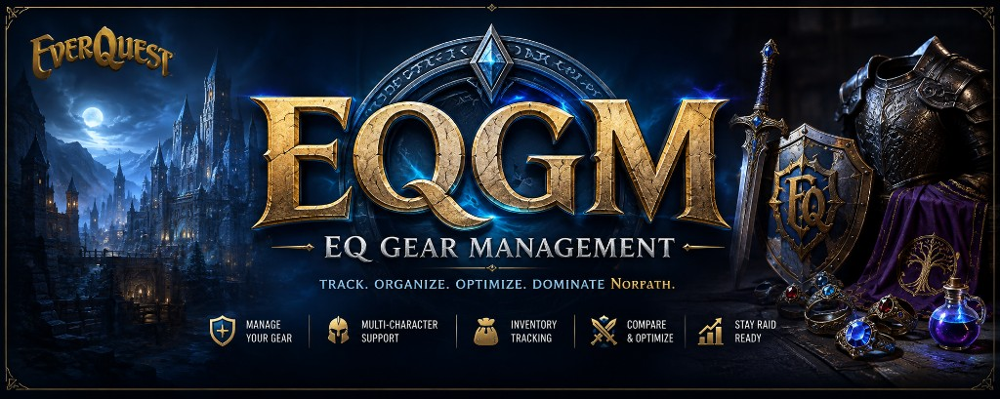
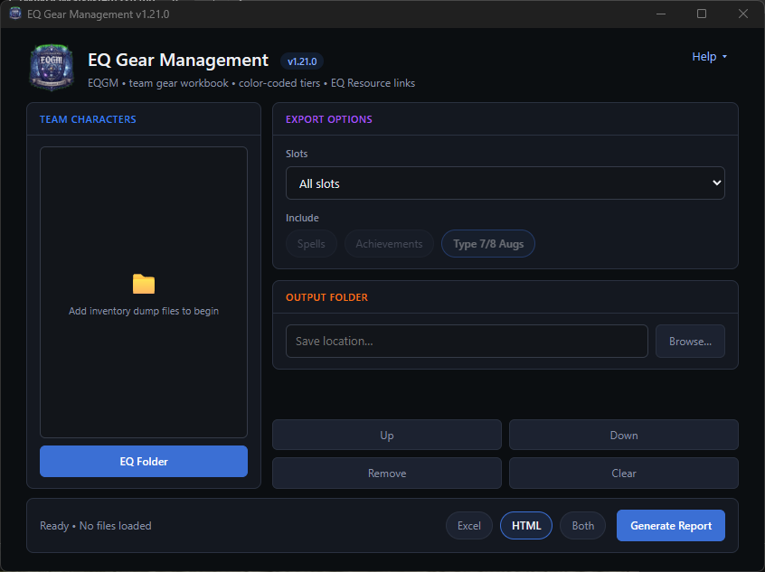

  

# EQ Gear Management (EQGM)

Turn EverQuest inventory output files into a team **Excel workbook** and optional **HTML report** — equipped gear, tier levels, unmade craft mats, runes, spells, achievements, optional Type 7/8 aug recommendations, Type 5 aug display, and current-expansion Raid BiS.

Built for **EverQuest Live** only (not TLP or progression). Gear, runes, and related tracking go back as far as **Laurion's Song**.

---

## Download

Product page: **[neclub.github.io/EQ-Gear-Management](https://neclub.github.io/EQ-Gear-Management/)**

1. Open **[Releases](https://github.com/Neclub/EQ-Gear-Management/releases)** on GitHub.
2. Download **`EQGM-x.y.z.exe`** from the latest release.
3. Double-click to run. No Python install needed.

Installed copies check GitHub Releases when they open. If a newer version is available, a popup shows the current and newest versions and asks whether to download. You can also use **Help → Check for Updates**.

---

## How to use

### 1. Get output files in-game

On each character, run in EverQuest chat:

| Command | What it creates |
|---------|-----------------|
| `/outputfile inventory` | Required — `Name_server-Inventory.txt` (or `Name_server-CLASS-Inventory.txt` for personas) |
| `/outputfile missingspells` | Optional — spell and rune tabs |
| `/outputfile achievements` | Optional — achievement tabs |

Copy the `.txt` files from your EQ Logs folder into one folder on your PC.

### 2. Generate the report

1. Open **EQ Gear Management**.
2. Click **EQ Folder** and pick the folder with your output files; select which characters to import.
3. Adjust **Export options** and **Output folder** on the right if needed.
4. Choose **Excel**, **HTML**, or **Both**, then click **Generate Report**.

  

Output: `{Server}_Team Inventory.xlsx` (and `{Server}_Team_Inventory.html` if HTML is included). When HTML is included, the report opens in your default browser.

### What you get

- **Team Gear** — equipped items by slot, color-coded by tier
- **Gear T-Level** — expansion tier codes per slot (unknown items looked up on EQ Resource)
- **Unmade Gear** — raid craft mats and T1 containers still sitting in bags
- **Missing Runes / Spells / Useful Spells** — from MissingSpells output files; HTML Missing Runes can sort columns (roster, name, class, most missing) and filter by expansion
- **Rune Inventory** — raid runes on hand
- **Achievements** — collections, Mercenary/Partisan quests, and raid progress (from achievement output files)
- **Type 7/8 Augs** — optional type 7/8 recommendations (on by default); only augs that fit type 7/8 holes; equipped Velium Empowered Gem of Freezing is kept as a must-have
- **Type 5 Augs** — optional display of equipped type 5 augs and Empty holes (on by default); expansion + heroic stats; sortable HTML columns; no upgrade suggestions; link to the EQ Resource Type 5 list
- **Raid BiS** — optional current-expansion raid T1/T2 armor and jewelry vs equipped gear (on by default); Evolvers are not scored and may still be BiS; HTML paperdoll with a Character filter
- **HTML report** — the same data in a browser, searchable and filterable

For file naming, Alternate Personas, reading each sheet, and troubleshooting, see **[HowToUse.md](HowToUse.md)**.

## License

Apache License 2.0. See [LICENSE](LICENSE).
